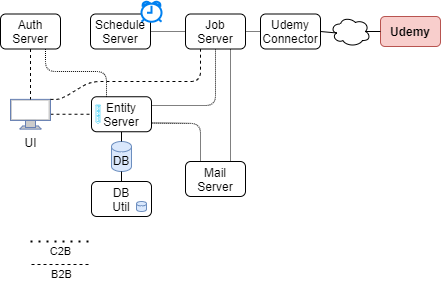

# OReport
```
  _____                      __ _ _      ____   _____                       _   
 |  ___|                     \ \ \ \    / __ \ |  __ \                     | |  
 | |_ _ _  __ _  __ _  ___ _ _\ \ \ \  | |  | || |__) |___ _ __   ___  _ __| |_ 
 |  _| '_|/ _` |/ _` |/ _ \ '_|\ \ \ \ | |  | ||  _  // _ \ '_ \ / _ \| '__| __|
 | | | | | (_| | (_| |  __/ |  / / / / | |__| || | \ \  __/ |_) | (_) | |  | |_ 
 \_| |_|  \__,_|\__, |\___|_| / / / /   \____/ |_|  \_\___| .__/ \___/|_|   \__|
================|___/========/_/_/_/   ===================|_|===================
 :: Frager ::               (v0.0.1)                                           
```

# Familia de aplicaciones

| Nombre | Reporte Sonarqube (más info en cada app) |
| - | - |
| [oreport-parent](app/oreport-parent) | [](http://go.tempestad-online.com:19000/dashboard?id=oreport-parent) [](http://go.tempestad-online.com:19000/dashboard?id=oreport-parent) [](http://go.tempestad-online.com:19000/dashboard?id=oreport-parent) [](http://go.tempestad-online.com:19000/dashboard?id=oreport-parent)|
| [udemy-connector](app/udemy-connector) | [](http://go.tempestad-online.com:19000/dashboard?id=udemy-connector) [](http://go.tempestad-online.com:19000/dashboard?id=udemy-connector) [](http://go.tempestad-online.com:19000/dashboard?id=udemy-connector) [](http://go.tempestad-online.com:19000/dashboard?id=udemy-connector) |

## Aspectos técnicos

- ✔️ Microservicios en su totalidad.
- Framework de Front Optativo. 
  - ✔️ Angular.
  - 🤔 Pueden usar Websocket (suma puntos)
    - 🤔 Buscar una "cola" independiente?
    - 🤔 Kafka?
- Framework de Backend: 
  - ✔️ Springboot 
  - 🤔 Spring Webflux
  - ✔️ Spring Rest
  - ✔️ Spring Data
- ✔️ Aplicacion autoejecutable.
- ✔️ Autenticación -> JWT
- Batch Scheduling: 
  - 🤔 Quartz
  - 🤔 Spring Batch (optativo).
- 🤔 Motor de Base de Datos Optativo.
  - 🎁 Liquibase
- 🤔 Envio de correos.
  - Customizables
    - 🤔 StringTemplate?

## Aspectos funcionales

- Auth
  - C2B
  - B2B 
- 🎁 Roles
  - Admin
    - Login
    - ABM Users
  - User
    - Login
    - Control de schedulers
  - Anon
    - Ver rankings
- Procesos Batch
  - Dashboard
    - Intervalos configurables
    - 🎁 Apagables
    - Ejecución manual
    - 🎁 Dashboard info de ejecuciones previas
    - 🎁 Envio de Correo con OK configurable
  1. Llamar mensualmente a los servicios de Udemy y actualizar la bbdd local
      - Enviar mails informativos a modo de resumen a todos los usuarios y sus people leads (que están en el CSV) con la siguiente información:
      - Cantidad de cursos finalizados en el mes y en total.
      - 🤔 Avance en el Learning Path en el último mes y en total.
      - 🤔 Advertencia en caso de que no hayan terminado ningún curso en un lapso de tiempo configurable.
        - Definir con los datos disponibles la fórmula más adecuada para reconocer un curso como “terminado”. 
      - Opcional: Informar posición en el ranking de los usuarios que se capacitaron en el último mes.
- Reportes:
  -	Top ten mensual de los usuarios que más se capacitaron en el último mes.
    - 🤔 Hateoas + paginacion?
  -	Avance total de cada usuario en un Learning Path específico. 
  - 🤔 Avance por fecha desde/hasta de cada usuario en un Learning Path. 
    - Columnas indexadas!
  - Reporte individual por usuario. Mostrar la información que crean conveniente.
  - Reporte indicando todos los usuarios que no finalizaron ningún curso en los últimos 6 meses.
  - Reporte de usuarios que tienen licencia y ya no están más (o nunca estuvieron) en el CSV de usuarios provisto.

---

